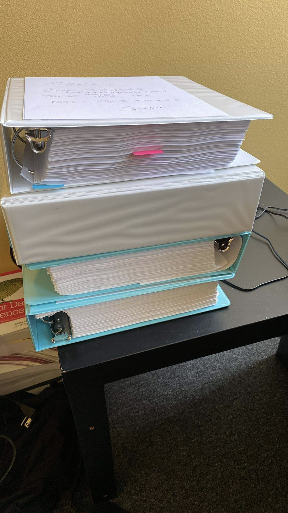

# crisis_assessments
 <h2>OCR input of MH crisis assessments</h2>  

Client presented with 54 months of printed mental health crisis assessments that need(ed) to be analyzed for diagnostic significance. This consisted of 18 three-inch, 3-ring binders of printed materials that needed to be converted into machine-readable format.

<b>Scanning</b> 

I scanned the documents as *.tif files. Each month of data consisted of approximately 75 to 80 records. I scanned the files in batches of twenty records and employed split_tiff.py to separate the multipage TIFF file into individual files.

<b>OCR</b> 

I then iterated over the individual image files using PyTesseract to extract text from the image files using OCR. This created an individual text file for each of the image files. I embedded the path of the image file in the resulting text file for ease of matching the two if necessary.

<b>Dataframe and Validation</b> 

Finally, I employed regular expressions to map the recognized text to a dataframe, and saved the dataframe as *.csv for validation. The OCR_to_DF.py resulted in about 78% completion, else throwing "NA" for unrecognized text. While the validation and correction in a spreadsheet format takes some time, it is much faster than entering all of the data manually. Not only is this step required for accuracy, but each record consisted of two pages: one passed via OCR; the other, highlighted dichotomous nominal entries, which have to be entered manually but are just coded "0" and "1" so the data cleaner can speed through these 12 items.

